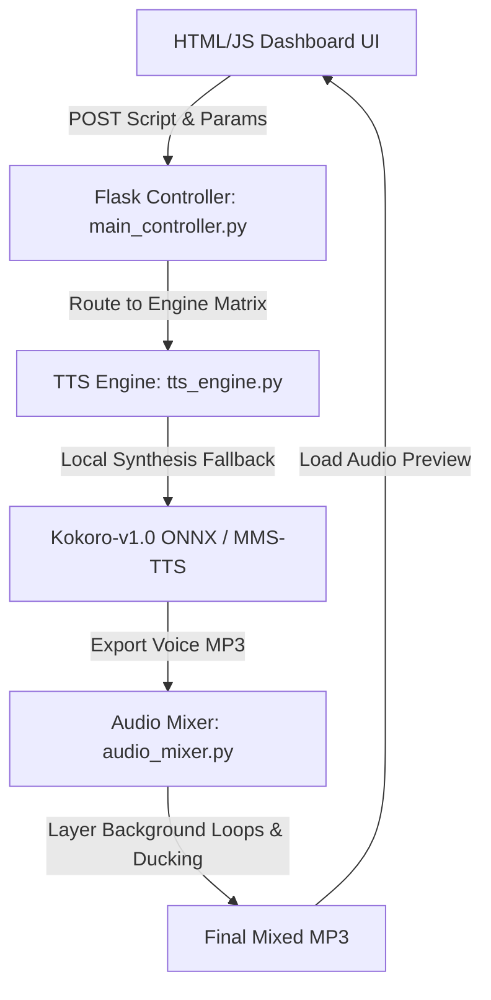

# 🎙️ AdVocalist Studio
> **Industrial AI Ad-Campaign Hook & Audio Generator**

AdVocalist Studio is a high-performance Python web application prototype (built using Flask, HTML5, and Vanilla CSS) designed for creating professional audio ad campaigns. It features a modern, single-page dark-mode dashboard with advanced emotional pacing parameters, multi-engine routing (Tier 1/2/3), a zero-shot voice cloning uploader, and an integrated audio mixer console with dynamic background music ducking.

---

## ✨ Features

### 1. Unified Script Console
* **Bilingual Support**: Fully optimized for English, Bangla, and mixed bilingual (Banglish) script variants.
* **Tag & Expression Sanitizer**: Automatically parses and sanitizes paralinguistic expression bracket tags (e.g. `[excited]`, `[laughs]`) to prevent fallback engines from speaking them literally.

### 2. Ad Emotional Control Suite
* **Vibe Presets**: Select from curated styles including *Confident/Corporate*, *High Excitement/Promo*, *Urgent/Limited Time*, *Premium/Luxury*, and *Intimate/Whisper*.
* **Dynamic Intensity Slider (1-100%)**: Automatically scales speech pacing and volume density based on selection.
* **Delivery Pacing Speed Slider (0.5x to 2.0x)**: Natively adjusts output duration inside the speech synthesis core.
* **Target Synthesis Voice Selector**: Choose from a curated library of high-quality female and male speakers:
  * **American Female**: Bella, Sarah, Heart, Nicole, Sky
  * **American Male**: Adam, Michael
  * **British Female**: Emma, Isabella
  * **British Male**: George, Lewis
* **Zero-Shot Voice Cloning Bay**: Uploader accepting reference WAV/MP3 files (3-10s) to map speaker profiles dynamically.

### 3. Dynamic Engine Matrix
Models are automatically categorized and active state is determined based on language selection:
* **Tier 1 (Expressive/Autoregressive)**: *Fish Audio (S2 Pro)*, *Chatterbox-Turbo*
* **Tier 2 (Zero-Shot/Conversational)**: *IndexTTS-2*, *VoiceCloner-Ultra*
* **Tier 3 (Foundational & Clients)**: *MMS-TTS (Bengali)*, *voice-generator.com Client Engine*, and a local *Kokoro-v1.0 ONNX* high-fidelity fallback.

### 4. Master Production Mixer Console
* **Commercial Background Jingle Bed**: Instantly mix vocals with premium audio loops:
  * *Corporate Luxury*, *Cyberpunk*, *Cinematic Promo*, *Upbeat Tech*, *Ambient Whisper*
* **Level Sliders**: Precise control over Voice Track Level (0-100%) and Background Bed Level (0-100%).
* **Dynamic Ducking Threshold (0-25 dB)**: Automatically attenuates the volume of the background music loop whenever the voice track is speaking to ensure vocal clarity.

---

## 🛠️ Installation & Setup

### 1. Prerequisites
Ensure you have **Python 3.10+** installed on your system. 

### 2. Download ffmpeg
This application utilizes `pydub` for high-performance server-side audio mixing, which requires `ffmpeg`.
* Place your `ffmpeg.exe` and `ffprobe.exe` binaries directly inside the local `bin/` directory within the workspace.

### 3. Install Dependencies
Run the following command to install the required Python packages:
```bash
pip install -r requirements.txt
```

### 4. Start the Application
Launch the Flask development server:
```bash
python app.py
```
Open your browser and navigate to **`http://127.0.0.1:5000`**.

---

## 📂 Architecture Overview


---

## 📝 License
This project is licensed under the MIT License.
